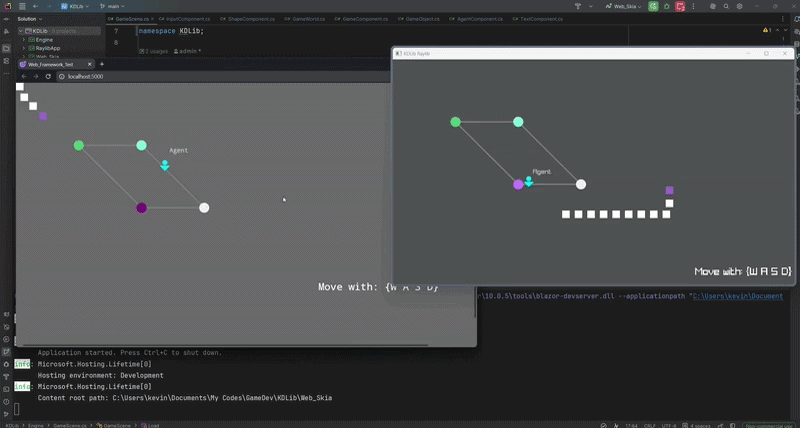

# KDLib — A Portable 2D Game Framework for C# Enjoyers



Are you a C# enjoyer looking for a lightweight, straightforward game framework that lets you write your game once and play it in the browser — just write C# code and launch your game in the browser, no JS, no TypeScript, no export headache?

Then you are looking at the right place.

**[▶ Play the Live Demo](https://kevinyippp.github.io/KDLib_Demo/)**

---

## The Problem

Getting C# games to run in a browser has always been a bit problematic. General C# game engines and frameworks don't really work that well with web export other than Unity, and Unity comes with its own overhead and workflow. As far as I can tell there isn't a really straightforward option for someone who just wants to write C# game logic and have it run in the browser without a lot of friction — at least none that worked well for my use case.

KDLib is my attempt at solving that for myself, and maybe for others in the same situation.

---

## What It Is

KDLib is a simple component-based 2D game framework built around a renderer abstraction layer. The core idea is straightforward — **rendering is just a function of game state**. Your game logic never knows or cares what's drawing it.

```
[ Your Game Logic ]       ← same code, always
─────────────────────     ← ICanvas / IInputState
[ SkiaSharp + Blazor ]    ← web
[ Raylib ]                ← desktop
```

The same `GameScene.cs` runs identically on both targets with zero changes.

---

## Features

- **Write once, run anywhere** — same game code runs on desktop and in the browser natively
- **Blazor WebAssembly** as the web host — real .NET in the browser, not transpiled JS
- **Component-based architecture** — `GameObject` + `GameComponent`, similar to Unity's MonoBehaviour but lightweight
- **Renderer abstraction** via `ICanvas` — swap between SkiaSharp (web) and Raylib (desktop) freely
- **Input abstraction** via `IInputState` — input handling decoupled from platform
- **Basic game loop** with delta time
- **AABB collision system**
- **Sprite animation** with frame support
- **Shape rendering** — circles, rectangles, triangles, lines
- **Text rendering**

---

## Getting Started

Clone the repo and open in **Visual Studio** or **Rider**. You'll find three projects:

| Project | Purpose |
|---|---|
| `Engine` | Core game logic, components, abstractions — start here |
| `Web_Skia` | Blazor WASM host using SkiaSharp for web deployment |
| `RaylibApp` | Desktop host using Raylib for native development and debugging |

The best place to understand how it all fits together is **`Engine/GameScene.cs`** — it's where the game world is constructed and shows the component system in action.

**Run on desktop:**
```bash
# Set RaylibApp as startup project and run
```

**Run on web:**
```bash
# Set Web_Skia as startup project and run
# Navigate to localhost:5000
```

---

## Why Two Targets?

WASM debugging is still limited — breakpoints don't work reliably. The Raylib desktop target exists so you can develop and debug your game logic normally with full IDE support, then deploy to web with confidence that only visual differences (if any) will exist between the two renderers.

Logic bugs surface on both targets equally. Visual discrepancies are visible to the eye and don't need a debugger.

---

## Architecture Overview

```
GameWorld
├── GameObject
│   ├── SpriteComponent
│   ├── InputComponent
│   ├── VelocityComponent
│   ├── CollisionComponent
│   └── ...any GameComponent
└── OnDraw / OnUpdate events

ICanvas          ← rendering contract
IInputState      ← input contract
ISprite          ← asset contract
```

Adding a new platform means implementing `ICanvas` and `IInputState`. That's it. Your game logic is untouched.

---

## Roadmap

- [ ] Audio abstraction (`IAudioPlayer`)
- [ ] Camera and viewport system

---

## Built With

- [SkiaSharp](https://github.com/mono/SkiaSharp) — 2D rendering for web
- [Raylib-cs](https://github.com/chrisdill/raylib-cs) — native desktop rendering  
- [Blazor WebAssembly](https://dotnet.microsoft.com/en-us/apps/aspnet/web-apps/blazor) — web host

---

## License

MIT
